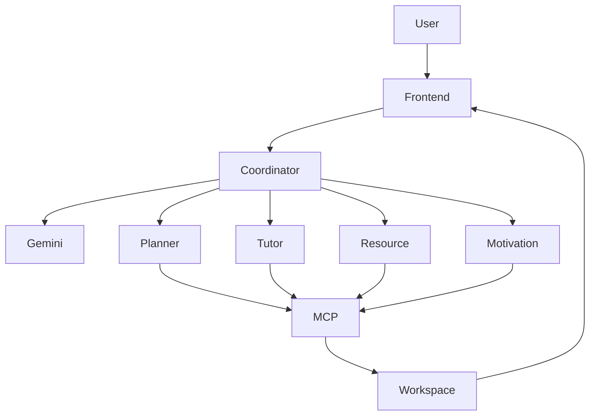

# 🌸 BloomTrack AI OS

> **An AI-powered Learning Operating System built with Google Gemini, Multi-Agent Architecture, and the Model Context Protocol (MCP).**

BloomTrack AI OS helps students plan, learn, stay organized, and stay motivated through intelligent AI agents. Instead of using multiple disconnected applications, BloomTrack provides a unified AI-powered workspace that automates study planning, resource management, progress tracking, and personalized learning.

---

## ✨ Features

- 🤖 Multi-Agent AI System
- 📚 AI Study Planner
- 📝 Smart Task & Goal Management
- 📅 Calendar Scheduling
- 📖 Learning Hub
- 🌸 Bloom Garden Gamification
- 🏆 XP, Coins & Achievements
- ⏳ Focus Timer
- 📊 Dashboard & Analytics
- 🎯 Adaptive Recommendations

---

## 🧠 Multi-Agent Architecture

BloomTrack uses specialized AI agents working together:

- **Coordinator Agent** – Understands user intent and orchestrates workflows.
- **Planner Agent** – Creates study plans, goals, and schedules.
- **Tutor Agent** – Explains concepts and guides learning.
- **Resource Agent** – Recommends curated learning resources.
- **Motivation Agent** – Awards XP, coins, and updates the Bloom Garden.

---

## 🔌 MCP Integration

BloomTrack demonstrates practical use of the **Model Context Protocol (MCP)** through tools for:

- Goal Management
- Task Management
- Calendar Scheduling
- Resource Management
- Progress Tracking
- Workspace Synchronization

---

## 🏗️ Architecture



---

## 🛠️ Tech Stack

**Frontend**
- React
- Vite
- Tailwind CSS
- Framer Motion

**Backend**
- Node.js
- Express.js

**AI**
- Google Gemini 2.5 Flash

**Architecture**
- Multi-Agent System
- MCP Server

---

## 🚀 Installation

```bash
git clone https://github.com/yourusername/BloomTrack-AI-OS.git

cd BloomTrack-AI-OS

npm install

cd backend

npm install

node server.js
```

Start the frontend:

```bash
npm run dev
```

Create a `.env` file:

```env
GEMINI_API_KEY=YOUR_API_KEY
```

---

## 🎥 Demo Prompts

Try these prompts:

- Help me crack placements in 6 months
- Create a DSA study plan
- Explain Binary Search
- Schedule my fitness routine
- What should I focus on today?

---

## 🎯 Google AI Concepts Demonstrated

- ✅ Google Gemini
- ✅ Multi-Agent Architecture
- ✅ MCP Server
- ✅ Agent Orchestration
- ✅ Adaptive Learning
- ✅ AI Workspace Automation

---

## 👥 Team

**Team:** Agent Bloom

**Track:** Agents for Good

